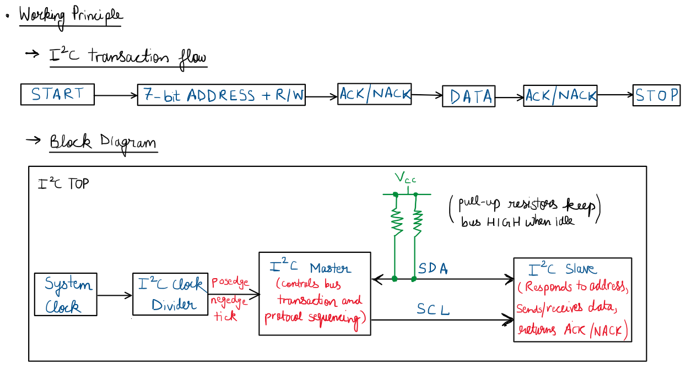
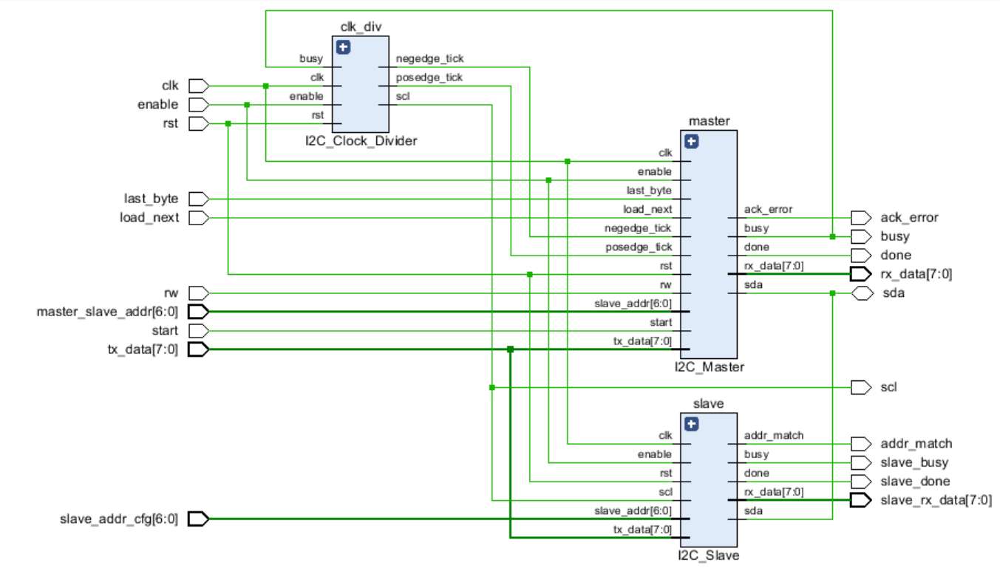
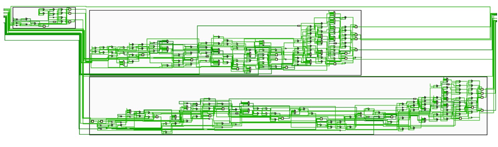
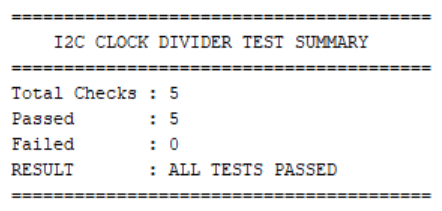
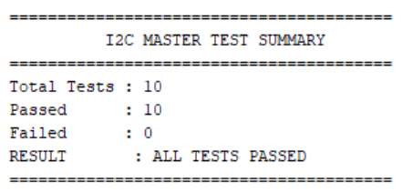
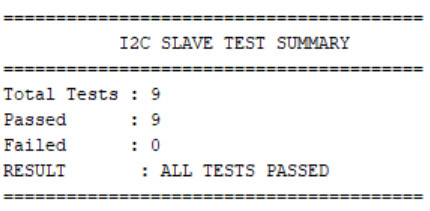
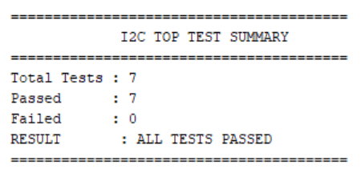

# I²C Controller

## 1. Overview

The repository provides a configurable Verilog implementation of the Inter-Integrated Circuit (I²C), also known as the **Two-Wire Interface (TWI)** communication protocol. The design consists of dedicated **Master**, **Slave**, **Clock Divider**, and **Top-Level Integration** modules that communicate over the shared Serial Data Line (`SDA`) and Serial Clock Line (`SCL`).

## 2. Features

- Configurable I²C Master and Slave implementation in Verilog.
- Supports 7-bit slave addressing.
- Supports Master `READ` and `WRITE` transactions.
- Supports single-byte and multi-byte transfers.
- Implements `ACK`/`NACK` handling.
- Supports mid-transaction disable.
- Includes task-based, self-checking verification.

## 3. Working Principle

I²C uses two shared lines: `SDA` for data and `SCL` for the serial clock. The Master begins communication with a `START` condition, followed by a **7-bit slave address** and `R/W` bit.

The addressed Slave responds with an `ACK`. In a `WRITE`, the Master sends data to the Slave; in a `READ`, the Slave sends data to the Master. For multi-byte transfers, the `DATA` and `ACK` phases repeat as required.

The transaction ends with a `STOP` condition, where `SDA` transitions from LOW to HIGH while `SCL` is HIGH.

<div align = "center">



</div>

## 4. Repository Structure

```text
I2C_Controller/
│
├── src/
│   ├── I2C_Clock_Divider.v
│   ├── I2C_Master.v
│   ├── I2C_Slave.v
│   └── I2C_TOP.v
│
├── tb/
│   ├── I2C_Clock_Divider_tb.v
│   ├── I2C_Master_tb.v
│   ├── I2C_Slave_tb.v
│   └── I2C_TOP_tb.v
│
├── images/
│   ├── working_principle.png
│   ├── schematic.png
│   ├── schematic_zoomed.png
│   ├── clk_divider_console.png
│   ├── master_console.png
│   ├── slave_console.png
│   └── top_console.png
│ 
├── waveforms/
│   ├── clk_divider_waveform.png
│   ├── master_waveform.gif
│   ├── slave_waveform.gif
│   └── top_waveform.gif
│
├── README.md
├── VERIFICATION.md
└── LICENSE
```


## 5. Configuration Parameters

| Parameter | Default Value | Description |
|:---:|:---:|:---:|
| `DATA_WIDTH` | `8` | Sets the width of the transmitted and received data. |
| `CLK_FREQ` | `100_000_000` | System clock frequency in Hz. |
| `I2C_FREQ` | `100_000` | Target I²C serial clock frequency in Hz. |

## 6. Module Description

| Module | Description |
|:---:|:---:|
| `I2C_Clock_Divider` | Generates the `SCL` clock and corresponding rising/falling edge ticks from the system clock. |
| `I2C_Master` | Controls `START`/`STOP` generation, slave addressing, `READ`/`WRITE` transfers, `ACK`/`NACK` handling, and multi-byte communication. |
| `I2C_Slave` | Detects `START`/`STOP` conditions, matches the received slave address, handles `ACK`/`NACK` responses, and transmits or receives data. |
| `I2C_TOP` | Integrates the Master, Slave, and Clock Divider modules over the shared `SDA` and `SCL` lines. |

## 7. Verification

> [!NOTE]
> A detailed verification report covering the verification methodology, test cases, waveform analysis, debugging process, and final results is documented in [VERIFICATION.md](https://github.com/theYash856/I2C_Controller/blob/main/VERIFICATION.md).

## 8. Simulation & Results

### 8.1. RTL Schematic

#### Top View

<div align = "center">



</div>

---

#### Expanded View

<div align = "center">



</div>

---

### 8.2. Integrated I²C Controller Waveform

<div align="center">


</div>

---

### 8.3. Verification Summary

The following console outputs summarise the final self-checking verification results for each I²C module.

<table>
  <tr>
    <th>I²C Clock Divider</th>
    <th>I²C Master</th>
    <th>I²C Slave</th>
    <th>I²C TOP</th>
  </tr>
  <tr>
    <td></td>
    <td></td>
    <td></td>
    <td></td>
  </tr>
</table>

## 9. Key Learnings

- Developed a practical understanding of the I²C communication protocol and its transaction flow.
- Implemented bidirectional communication over a shared `SDA` line using **open-drain behaviour**.
- Understood how bus ownership changes between Master and Slave during `READ` and `WRITE` transactions.
- Improved understanding of synchronizing FSM behaviour with clock edges and protocol timing.

## 10. Tools & Concepts Used

**Language:** Verilog HDL

**EDA Tools:** Xilinx Vivado (RTL analysis and simulation). The design is also compatible with online EDA platforms.

**New Concepts Explored:** Bidirectional Data Transfer, Open-Drain Communication, Shared-Bus Operation, 7-bit Addressing, and `ACK`/`NACK` Handling.
