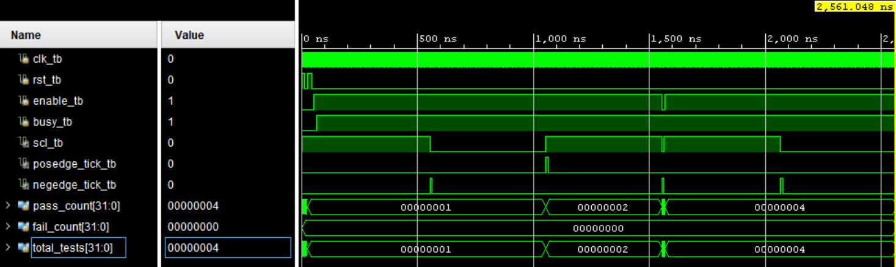

# I²C Controller Verification

## 1. Verification Objective

The primary objective of this verification document is to demonstrate that the I²C Controller functions as intended by validating its required functionality, normal operating conditions, and relevant edge cases. This includes verification of the **I²C Clock Divider**, **I²C Master**, **I²C Slave**, and the integrated **I²C TOP** module.

A secondary objective is to strengthen RTL verification skills through the development of structured, task-based, self-checking testbenches and by gaining practical debugging experience throughout the design and verification process.

## 2. Testbench Architecture

Dedicated testbenches were developed for the following modules:

- `I²C_Clock_Divider_tb`
- `I²C_Master_tb`
- `I²C_Slave_tb`
- `I²C_TOP_tb`

Each testbench follows a common verification architecture consisting of:

- Clock and reset generation
- DUT instantiation
- Input stimulus generation
- Output monitoring using `$monitor`
- Waveform dumping using `$dumpfile` and `$dumpvars`
- Reusable driver and checker tasks
- Automated self-checking with PASS/FAIL reporting and a final verification summary

## 3. Verification Methodology

The I²C Controller was verified using a **bottom-up approach**, where each module was validated independently before verifying the complete integrated design.  

The following sections summarise the functional test cases executed for each module along with their verification results.

## 4. Important I²C Concepts

### 4.1. Bidirectional Shared SDA Line

Unlike protocols that use separate transmit and receive signals, I²C uses a single shared `SDA` line for communication in both directions. Therefore, control of `SDA` changes between the Master and Slave depending on whether the current phase contains an address, data byte, `ACK`, or `NACK`.

### 4.2. Open-Drain Communication

I²C devices do not actively drive the `SDA` line HIGH. They either pull the line LOW or release it to a high-impedance state (`Z`). A pull-up resistor then restores the line to logic HIGH.  

This allows multiple devices to safely share the same bus line.

### 4.3. Pull-Up Resistors

Both `SDA` and `SCL` remain HIGH when the I²C bus is idle. Pull-up resistors are therefore required to establish the default HIGH state whenever no device is pulling the line LOW.

### 4.4. Addressing and R/W Bit

After the START condition, the Master sends a 7-bit slave address followed by a single `R/W` bit.

- `R/W = 0` indicates a `WRITE`.
- `R/W = 1` indicates a `READ`.

Only the Slave whose configured address matches the transmitted address responds to the transaction.

### 4.5. ACK and NACK

After every transmitted address or data byte, the receiving device responds during an additional clock pulse.

- **ACK:** `SDA` is pulled LOW, indicating successful reception.
- **NACK:** `SDA` remains HIGH, indicating that the transfer should not continue or that no further data is requested.

## 5. Test Cases

### 5.1. I²C Clock Divider

| Test ID | Test Case | Purpose | Result |
|:------:|:------------:|----------|:------:|
| CD-01 | Reset DUT | Verify `SCL` returns HIGH and both edge tick signals remain deasserted after reset. | ✅ Pass |
| CD-02 | Rising Edge Verification | Verify `posedge_tick` is asserted when `SCL` transitions HIGH. | ✅ Pass |
| CD-03 | Falling Edge Verification | Verify `negedge_tick` is asserted when `SCL` transitions LOW. | ✅ Pass |
| CD-04 | Disable DUT | Verify disabling the Clock Divider forces `SCL` HIGH and deasserts both edge tick signals. | ✅ Pass |
| CD-05 | Re-enable DUT | Verify clock generation resumes correctly after the Clock Divider is re-enabled. | ✅ Pass |

### 5.2. I²C Master

| Test ID | Test Case | Purpose | Result |
|:------:|:------------:|----------|:------:|
| M-01 | Single-Byte WRITE | Verify a complete single-byte `WRITE` transaction with valid slave acknowledgement. | ✅ Pass |
| M-02 | Alternate Address WRITE | Verify the Master correctly transmits a `WRITE` transaction using a different 7-bit slave address. | ✅ Pass |
| M-03 | Write `0x00` | Verify correct transmission of an all-zero data pattern. | ✅ Pass |
| M-04 | Write `0xFF` | Verify correct transmission of an all-one data pattern. | ✅ Pass |
| M-05 | Write `0xAA` | Verify correct transmission of an alternating `10101010` data pattern. | ✅ Pass |
| M-06 | Write `0x55` | Verify correct transmission of an alternating `01010101` data pattern. | ✅ Pass |
| M-07 | Back-to-Back WRITE – First Transaction | Verify the Master can complete a `WRITE` transaction and return to a state ready for another transfer. | ✅ Pass |
| M-08 | Back-to-Back WRITE – Second Transaction | Verify a second `WRITE` transaction can begin immediately after the previous transaction completes. | ✅ Pass |
| M-09 | Multi-Byte WRITE | Verify two bytes can be transmitted in a single transaction using `load_next` and `last_byte` control. | ✅ Pass |
| M-10 | Multi-Byte WRITE with NACK | Verify the Master detects a `NACK` after the second byte, asserts `ack_error`, and terminates the transaction. | ✅ Pass |

> [!NOTE]
> 1. The Master testbench uses a "fake" slave-side SDA driver to emulate slave acknowledgements and received data behaviour. This isolates the `I2C_Master` module from the actual Slave implementation and allows its transaction sequencing to be verified independently.
>
> 2. During multi-byte verification, `load_next` indicates that another byte is available, while `last_byte` identifies the final byte of the transfer. This allows the Master to continue through repeated `DATA` and `ACK` phases before generating the `STOP` condition.

### 5.3. I²C Slave

| Test ID | Test Case | Purpose | Result |
|:------:|:------------:|----------|:------:|
| S-01 | Address Match | Verify the Slave recognizes its configured 7-bit address and asserts `addr_match`. | ✅ Pass |
| S-02 | Address Mismatch | Verify the Slave rejects an unmatched address and keeps `addr_match` deasserted. | ✅ Pass |
| S-03 | Single-Byte WRITE | Verify the Slave correctly receives a single data byte from the Master. | ✅ Pass |
| S-04 | Single-Byte READ | Verify the Slave correctly transmits a single data byte to the Master. | ✅ Pass |
| S-05 | Multi-Byte WRITE | Verify the Slave can receive multiple bytes within the same transaction. | ✅ Pass |
| S-06 | Multi-Byte READ – Byte 1 | Verify the first byte is transmitted correctly during a multi-byte `READ`. | ✅ Pass |
| S-07 | Multi-Byte READ – Byte 2 | Verify transmission continues correctly after receiving a Master `ACK`. | ✅ Pass |
| S-08 | Reset During Transaction | Verify the Slave aborts an active transaction and clears `busy` when reset is asserted. | ✅ Pass |
| S-09 | STOP Detection | Verify the Slave detects the `STOP` condition and asserts `done`. | ✅ Pass |

> [!NOTE]
> 1. The Slave testbench uses a "fake" Master that directly controls `SCL` and the shared `SDA` line. This allows the `I2C_Slave` module to be verified independently from the actual Master implementation.
>
> 2. The shared `SDA` line includes a **pull-up** and is driven using open-drain behaviour. The fake Master either pulls `SDA` LOW or releases it, matching the behaviour expected on an I²C bus.

### 5.4. I²C TOP

| Test ID | Test Case | Purpose | Result |
|:------:|:------------:|----------|:------:|
| T-01 | Address Match | Verify the integrated Master and Slave communicate successfully when the transmitted address matches the configured slave address. | ✅ Pass |
| T-02 | Address Mismatch | Verify the Slave rejects a transaction when the Master transmits a different slave address. | ✅ Pass |
| T-03 | Single-Byte WRITE | Verify a complete Master-to-Slave single-byte `WRITE` transaction through the integrated design. | ✅ Pass |
| T-04 | Single-Byte READ | Verify a complete Slave-to-Master single-byte `READ` transaction through the integrated design. | ✅ Pass |
| T-05 | Multi-Byte WRITE | Verify consecutive data bytes can be transferred from Master to Slave within the same transaction. | ✅ Pass |
| T-06 | Multi-Byte READ | Verify consecutive data bytes can be transferred from Slave to Master within the same transaction. | ✅ Pass |
| T-07 | Disable During Transaction | Verify disabling the controller during an active transaction aborts the transfer and clears the Master `busy` signal. | ✅ Pass |

> [!NOTE]
> 1. Separate `master_slave_addr` and `slave_addr_cfg` signals are used so that address-match and address-mismatch conditions can be tested independently.
>
> 2. The shared `SDA` and `SCL` lines include pull-ups to model the idle HIGH state of the I²C bus when no device is actively pulling the line LOW.

## 6. Waveform Analysis

### 6.1. I²C Clock Divider

The Clock Divider waveform confirms that `SCL` remains HIGH while idle and toggles only when the divider is enabled during an active transaction. The `posedge_tick` and `negedge_tick` signals are asserted in synchronization with the corresponding transitions of `SCL`.

---

### 6.2. I²C Master

The Master waveform verifies the sequencing of the `START`, `ADDRESS`, `ACK`, `DATA`, and `STOP` phases. It also shows the Master changing or releasing `SDA` according to the current transaction phase while progressing through the internal FSM states.

---

### 6.3. I²C Slave

The Slave waveform confirms correct detection of the transmitted address, acknowledgement behaviour, and data transfer in both `READ` and `WRITE` operations. The waveform also shows the Slave taking control of `SDA` only during the required acknowledgement and data-transmission phases.

---

### 6.4. I²C TOP

The integrated waveform verifies end-to-end communication between the Master and Slave over the shared `SDA` and `SCL` bus. It confirms correct synchronization between the Clock Divider, Master FSM, and Slave FSM throughout the complete transaction sequence.

## 7. Debugging Experience

### 7.1. Address Mismatch Verification Limitation

While developing the integrated testbench, the Address Match test worked correctly, but the Address Mismatch case continued to behave unexpectedly regardless of the address applied.

**Root Cause**

The same `slave_addr` signal was being supplied both as the Master's destination address and as the Slave's configured address. Changing the test address therefore changed both values together, meaning they could never actually mismatch.

**Resolution**

The TOP-level interface was separated into `master_slave_addr` and `slave_addr_cfg`, allowing the transmitted address and configured Slave address to be controlled independently.

**Key Learning**

A testbench must have independent control over values that are intended to be compared. Some verification problems originate from insufficient controllability rather than incorrect RTL functionality.

---

### 7.2. Misleading Watchdog Timeout

During integrated `READ` verification, the simulation suddenly reported a watchdog timeout, making it appear that a `wait()` condition or the I²C FSM had deadlocked.

**Root Cause**

The watchdog was global and started counting from the beginning of the simulation. Its original timeout was only `500 µs`, and several previous test cases had already consumed most of that time before the READ transaction began. The watchdog therefore expired during an otherwise valid transaction.

**Resolution**

The timeout was increased to provide sufficient time for the complete integrated verification sequence to execute.

**Key Learning**

A timeout failure does not necessarily indicate a DUT deadlock. Simulation time already consumed by previous tests must be considered before concluding that an FSM or handshake has become stuck.

---

### 7.3. Controller Remained Busy After Mid-Transaction Disable

The final integrated test disabled the controller while a transaction was active. Although clock generation stopped correctly, the testbench never observed the controller returning to an idle state.

**Root Cause**

Deasserting `enable` stopped the Clock Divider, but the Master and Slave FSMs retained their current transaction states. Since the protocol clock had stopped, they had no opportunity to naturally progress back to `IDLE`, leaving `busy` asserted.

**Resolution**

Explicit disable handling was added to the Master and Slave so that deasserting `enable` aborts the active transaction, returns both FSMs to `IDLE`, clears `busy`, and releases the shared bus.

**Key Learning**

Stopping a communication clock and aborting a communication transaction are different operations. When a design supports mid-transaction disable, every stateful block involved must have a defined recovery path.

## 8. Verification Results

| Module | Verification Checks | Result |
|:--------|:-------------------:|:------:|
| I²C Clock Divider | 5 | ✅ Pass |
| I²C Master | 10 | ✅ Pass |
| I²C Slave | 9 | ✅ Pass |
| I²C TOP | 7 | ✅ Pass |
| **Total** | **31** | ✅ **All Passed** |

## 9. Conclusion

The I²C Controller was successfully verified at both the individual module level and the integrated TOP level using structured, task-based, self-checking testbenches. The verification covered clock generation, address handling, single-byte and multi-byte `READ`/`WRITE` transactions, `ACK`/`NACK` behaviour, reset handling, and mid-transaction disable conditions.

The final integrated verification confirmed correct communication between the Master and Slave over the shared `SDA` and `SCL` lines, with all defined test cases passing successfully.

Beyond functional verification, the project provided practical experience in debugging protocol timing, handling bidirectional open-drain communication, and improving testbench reliability through automated checking and watchdog-based timeout detection.
